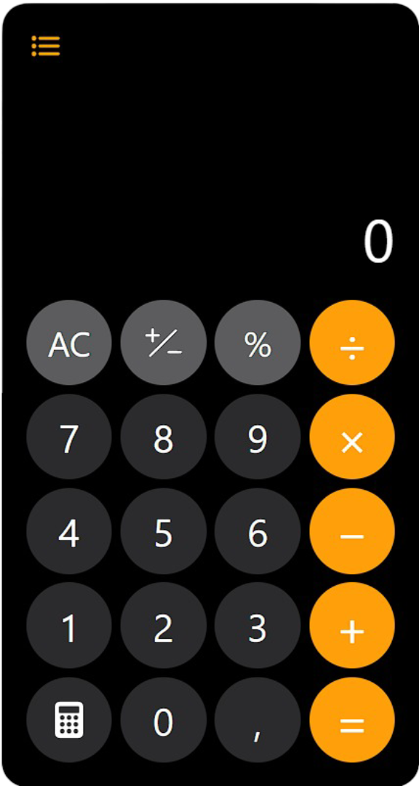
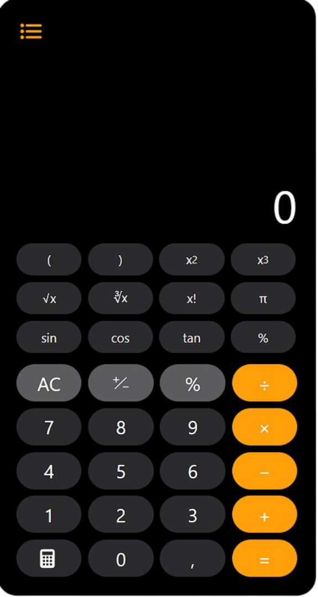
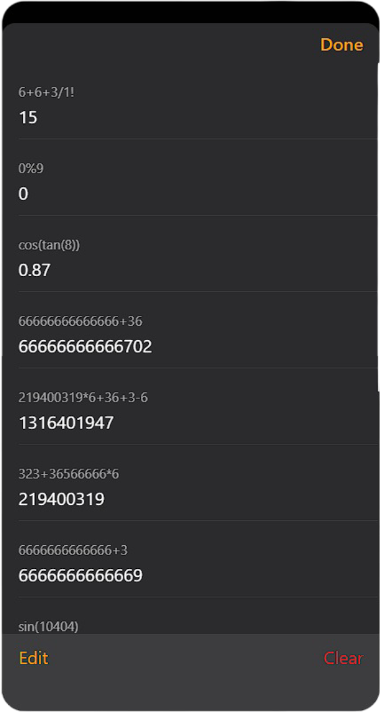

# Advanced Scientific Calculator

This repository features a **modern, web-based calculator** built with **Vanilla JavaScript** (OOP architecture). It supports both basic arithmetic and advanced scientific functions, featuring a responsive iOS-style design and persistent history.

---

## 🔗 Links

- **🚀 Live Demo:** [https://ios-calculator-ex.netlify.app/](https://ios-calculator-ex.netlify.app/)

---

## 📘 Key Features

- **Dual Modes:** Switch between Basic and Scientific keypads seamlessly.
- **Advanced Math:** Trigonometry (sin, cos, tan), roots (√, ∛), powers, and factorials.
- **Smart Input:** Context-aware **AC/CE** logic (smart backspace vs. clear all).
- **History System:** Calculations are saved to `LocalStorage`. You can review, copy results, or delete specific entries.
- **UX Enhancements:** Drag-to-scroll display for long expressions and "Click-to-Copy" functionality.

---

## 📱 Interface Modes

The interface adapts to your needs. You can toggle between a standard layout for everyday math and an expanded layout for complex calculations.

|                               **Basic Mode**                               |                             **Scientific Mode**                              |
| :------------------------------------------------------------------------: | :--------------------------------------------------------------------------: |
|  |  |
|                      _Standard arithmetic operations_                      |                         _Expanded scientific keypad_                         |

---

## 📜 History & Persistence

Never lose track of your calculations. The history menu saves your work even after you close the browser.

- **Edit Mode:** Delete specific entries using the red bin icon.
- **Copy:** Click on any expression or result to copy it to your clipboard.
- **Persistence:** All data is stored locally.

<div align="center">
  
</div>

---

## 🧠 Smart UI/UX

### Drag-to-Scroll Display

Handling long equations is easy. You can click and drag the display area to view hidden parts of long numbers, similar to native mobile touch interfaces.

### Context-Aware Clear

The clear button dynamically changes between **CE** (Backspace/Clear Entry) and **AC** (All Clear) depending on the context and recent keystrokes, mimicking iOS behavior.

---

## 🚀 How to Run

1. **Clone the repository:**

   ```bash
   git clone https://github.com/Xlussov/ios-calculator.git
   ```

2. **Open `index.html`** directly in your browser.

---

## 🛠 Tech Stack

- **HTML5** (Semantic structure)
- **CSS3** (Custom variables, flexbox/grid, responsive design)
- **JavaScript (ES6+)** (Class-based architecture, DOM manipulation, LocalStorage API)

---

© 2025 Danil Xlussov — A Calculator App.
